<!-- ═══════════════════════════════════════════════════════════════ -->
<!-- 🌐  ANIMATED PLEXUS HEADER  (auto-switches dark ↔ light)     -->
<!-- ═══════════════════════════════════════════════════════════════ -->

<picture>
  <source media="(prefers-color-scheme: dark)" srcset="./assets/header-dark.svg"/>
  <source media="(prefers-color-scheme: light)" srcset="./assets/header-light.svg"/>
  
</picture>

<h1 align="center"><b>Hi there, I'm Shakib Khan</b> 👋</h1>

  <picture>
    <source media="(prefers-color-scheme: dark)" srcset="https://readme-typing-svg.demolab.com?font=JetBrains+Mono&weight=600&size=22&duration=3000&pause=1200&color=58A6FF&center=true&vCenter=true&multiline=true&repeat=true&width=900&height=80&lines=%F0%9F%9A%80+Building+Full-Stack%2C+Cloud+%26+Mobile+Apps;%E2%98%81%EF%B8%8F+AWS+Certified+%7C+343%2B+LeetCode+Solved+%F0%9F%92%AA"/>
    <source media="(prefers-color-scheme: light)" srcset="https://readme-typing-svg.demolab.com?font=JetBrains+Mono&weight=600&size=22&duration=3000&pause=1200&color=1E40AF&center=true&vCenter=true&multiline=true&repeat=true&width=900&height=80&lines=%F0%9F%9A%80+Building+Full-Stack%2C+Cloud+%26+Mobile+Apps;%E2%98%81%EF%B8%8F+AWS+Certified+%7C+343%2B+LeetCode+Solved+%F0%9F%92%AA"/>
    
  </picture>

 

 

  
  &nbsp;
  

 

<!-- ═══════════════════════════════════════════════════════════════ -->

&nbsp;**_About Me_**

  <picture>
    <source media="(prefers-color-scheme: dark)" srcset="https://github-profile-summary-cards.vercel.app/api/cards/profile-details?username=shaki-cell&theme=tokyonight"/>
    <source media="(prefers-color-scheme: light)" srcset="https://github-profile-summary-cards.vercel.app/api/cards/profile-details?username=shaki-cell&theme=default"/>
    
  </picture>

💻 **I'm Shakib Khan**, a **B.Tech Computer Science & Engineering student** passionate about building **scalable full-stack web applications**, **cross-platform mobile apps with Flutter**, and **cloud-native solutions on AWS**.

⚡ I primarily work with **React**, **Node.js**, **Express.js**, **MongoDB**, **Flutter/Dart**, **Python**, and **C++**, transforming ideas into **production-grade applications** with clean UI and efficient architecture.

🚀 My interests include **Cloud Architecture (AWS)**, **Cross-Platform Mobile Development**, **Full Stack Engineering**, and **Competitive Programming**, where I continuously solve problems and build real-world solutions.

☁️ I'm **AWS Certified Cloud Practitioner** with hands-on experience in deploying and managing cloud services, and have solved **343+ problems on LeetCode**.

### 🎯 Currently Focused On

- ⚡ Building impactful **Full Stack & Flutter applications**
- ☁️ Deepening expertise in **AWS cloud services & architecture**
- 🧠 Strengthening **DSA & problem-solving skills** (LeetCode & Codeforces)
- 🌍 Open to **internships, collaborations & freelance projects**

✨ I enjoy learning by building, experimenting with emerging technologies, and continuously improving both my development and problem-solving abilities.

 

  

<!-- ═══════════════════════════════════════════════════════════════ -->

&nbsp;**_Tech Stack_**

<table align="center">
    <tr>
        <td align="center" width="90"> C</td>
        <td align="center" width="90"> C++</td>
        <td align="center" width="90"> Python</td>
        <td align="center" width="90"> Dart</td>
        <td align="center" width="90"> JavaScript</td>
        <td align="center" width="90"> HTML5</td>
        <td align="center" width="90"> CSS3</td>
        <td align="center" width="90"> React</td>
    </tr>
    <tr>
        <td align="center" width="90"> TailwindCSS</td>
        <td align="center" width="90"> Flutter</td>
        <td align="center" width="90"> Node.js</td>
        <td align="center" width="90"> Express.js</td>
        <td align="center" width="90"> Flask</td>
        <td align="center" width="90"> MongoDB</td>
        <td align="center" width="90"> MySQL</td>
        <td align="center" width="90"> Firebase</td>
    </tr>
    <tr>
        <td align="center" width="90"> AWS</td>
        <td align="center" width="90"> Docker</td>
        <td align="center" width="90"> Git</td>
        <td align="center" width="90"> GitHub</td>
        <td align="center" width="90"> Linux</td>
        <td align="center" width="90"> Postman</td>
        <td align="center" width="90"> VS Code</td>
        <td align="center" width="90"> Figma</td>
    </tr>
</table>

 

<!-- ═══════════════════════════════════════════════════════════════ -->

&nbsp;**_What I Build_**

<table>
<tr>
<td align="center" width="25%">
  
<b>React . Node.js . Express</b> 
<b>MongoDB . REST APIs</b>
</td>
<td align="center" width="25%">
  
<b>Dart . Flutter . Firebase</b> 
<b>Cross-Platform Development</b>
</td>
<td align="center" width="25%">
  
<b>Node.js . Express . Flask</b> 
<b>Authentication . CRUD</b>
</td>
<td align="center" width="25%">
  
<b>AWS . Serverless</b> 
<b>Cloud Architecture</b>
</td>
</tr>
</table>

 

<!-- ═══════════════════════════════════════════════════════════════ -->

&nbsp;**_Competitive Programming_**

<picture>
  <source media="(prefers-color-scheme: dark)" srcset="https://leetcard.jacoblin.cool/shakib_12?theme=dark&font=JetBrains%20Mono&ext=heatmap&border=0"/>
  <source media="(prefers-color-scheme: light)" srcset="https://leetcard.jacoblin.cool/shakib_12?theme=light&font=JetBrains%20Mono&ext=heatmap&border=0"/>
  
</picture>

 

 

<!-- ═══════════════════════════════════════════════════════════════ -->

&nbsp;**_GitHub Statistics_**

 

  <picture>
    <source media="(prefers-color-scheme: dark)" srcset="https://github-trophies.vercel.app/?username=shaki-cell&theme=tokyonight&no-frame=true&no-bg=true&margin-w=15&row=2&column=5"/>
    <source media="(prefers-color-scheme: light)" srcset="https://github-trophies.vercel.app/?username=shaki-cell&theme=flat&no-frame=true&no-bg=true&margin-w=15&row=2&column=5"/>
    
  </picture>

  <picture>
    <source media="(prefers-color-scheme: dark)" srcset="https://github-readme-stats-two-blond-83.vercel.app/api?username=shaki-cell&show_icons=true&theme=tokyonight&hide_border=true&count_private=true"/>
    <source media="(prefers-color-scheme: light)" srcset="https://github-readme-stats-two-blond-83.vercel.app/api?username=shaki-cell&show_icons=true&theme=default&hide_border=true&count_private=true"/>
    
  </picture>
  <picture>
    <source media="(prefers-color-scheme: dark)" srcset="https://streak-stats.demolab.com?user=shaki-cell&theme=tokyonight&hide_border=true"/>
    <source media="(prefers-color-scheme: light)" srcset="https://streak-stats.demolab.com?user=shaki-cell&theme=default&hide_border=true"/>
    
  </picture>

 

  <picture>
    <source media="(prefers-color-scheme: dark)" srcset="https://github-readme-stats-two-blond-83.vercel.app/api/top-langs/?username=shaki-cell&layout=compact&hide_border=true&theme=tokyonight"/>
    <source media="(prefers-color-scheme: light)" srcset="https://github-readme-stats-two-blond-83.vercel.app/api/top-langs/?username=shaki-cell&layout=compact&hide_border=true&theme=default"/>
    
  </picture>

 

<!-- ═══════════════════════════════════════════════════════════════ -->

&nbsp;**_Contribution Snake_**

  <picture>
    <source media="(prefers-color-scheme: dark)" srcset="https://raw.githubusercontent.com/SHAKI-cell/SHAKI-cell/output/snake-dark.svg" />
    <source media="(prefers-color-scheme: light)" srcset="https://raw.githubusercontent.com/SHAKI-cell/SHAKI-cell/output/snake.svg" />
    
  </picture>

 

  <picture>
    <source media="(prefers-color-scheme: dark)" srcset="https://github-readme-activity-graph.vercel.app/graph?username=shaki-cell&bg_color=1A1B27&color=38BDF8&line=70A5FD&point=FFFFFF&area=true&hide_border=true&custom_title=Shakib%20Khan's%20Contribution%20Graph"/>
    <source media="(prefers-color-scheme: light)" srcset="https://github-readme-activity-graph.vercel.app/graph?username=shaki-cell&bg_color=ffffff&color=1e293b&line=3b82f6&point=1e40af&area=true&hide_border=true&custom_title=Shakib%20Khan's%20Contribution%20Graph"/>
    
  </picture>

 

<!-- ═══════════════════════════════════════════════════════════════ -->

&nbsp;**_Let's Connect_**

  
  &nbsp;
  
  &nbsp;
  
  &nbsp;
  
  &nbsp;
  

 

  <picture>
    <source media="(prefers-color-scheme: dark)" srcset="https://capsule-render.vercel.app/api?type=waving&color=0:58a6ff,50:1a3a5c,100:0d1117&height=120&section=footer"/>
    <source media="(prefers-color-scheme: light)" srcset="https://capsule-render.vercel.app/api?type=waving&color=0:93c5fd,50:bfdbfe,100:f0f9ff&height=120&section=footer"/>
    
  </picture>

  *"First, solve the problem. Then, write the code."* — John Johnson

  **Open to internships, collaborations, and software engineering opportunities.**

  From **SHAKI-cell** | **Portfolio** | AWS Certified Cloud Practitioner ☁️

